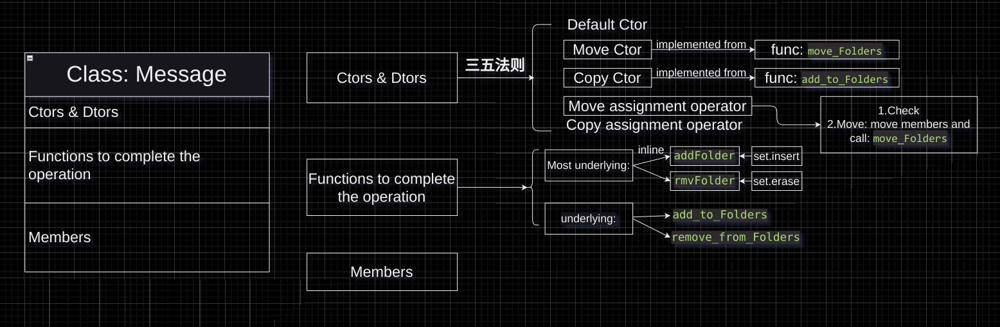

# 右值引用：从表达式讲起

## 什么是表达式

表达式是由数字，运算符，函数等组成的代码片段。

常见有以下几种表达式：

+ 算术表达式

```c++
int res = 2 + 3 * 4;
```

> 整条代码可算做一个表达式，它由等号左边和等号右边组成

+ 赋值表达式

```c++
int x = 114514;
x += 1919810;
x++;
```

> 辨析： `++x` 和 `x++`
>  
> 我认为，是`前缀递增运算符` 和 `后缀递增运算符` 这两种运算符的区别导致了 `x++` 与 `++x` 成为了两种不同的表达式
>
> + `++x` 是 **递增表达式**，它递增x的值。这是个唯一的表达式。同时多项时，先执行这条表达式，之后再考虑其他
> + `x++` 是 **赋值表达式**，当其他变量要接受 `x` 的时候，先交出 `x`，之后再递增 `x`
>
> 上述两表达式操作原理不同，所以生成的汇编程序可能不同

+ 函数调用表达式

```c++
int res = max(114, 514);
```

+ 条件表达式

```c++
int res = (x == 114) ? 514 : 1919810;
```

## 表达式的另一种分类方式：左值，右值

可以二元的将表达式分成 `左值表达式` 和 `右值表达式`：

```c++
int res = 2 + 3 * 4;
```

如上，`res`为**左值**，等号右侧 `2 + 3 * 4` 为**右值**
特殊例外较多，所以我们区分他们的方式主要是看：

+ 左值常被用作对象的身份(在内存中的位置)
+ 右值常被用作对象的值(仅表示对象包含的信息)

对于常规引用，可以看作是创建对象的别名，可称为左值引用，而右值引用则是直接引用对象的值，仅此而已

```c++
int a = 42;
int &p = a; // p:对象引用
/* 语法:左绑定到右 */
int &&r1 = a; // 错误:右值应用无法绑到左值上
int &p1 = a * 114; // 错误:右值无法绑到左值上
int &&r2 = a * 114; // 正确，右值引用
const int &p2 = a * 114; // 可以将const引用绑定到右值上
```

+ `const` 引用绑定右值
从生命周期看，左值可以根据使用方式而改变，但右值生命周期仅存在于语句内部
可以使用 `const` 引用绑定右值来延长右值表达式的生命周期：

```c++
int main() {
    int a = 42;
    const int &p2 = a * 114;
}
```

```asm
/* x86_64 clang 14.0.0 */
main:                                   # @main
        push    rbp
        mov     rbp, rsp
        mov     dword ptr [rbp - 4], 42       ; 42存入变量a,位置 [rbp - 4]
        imul    eax, dword ptr [rbp - 4], 114 ; 值114与变量相乘存入eax
        mov     dword ptr [rbp - 20], eax     ; 移入 位置[rbp - 20]
        lea     rax, [rbp - 20]               ; 存至 rax
        mov     qword ptr [rbp - 16], rax
        xor     eax, eax
        pop     rbp
        ret
```

可以看到，存在这条指令：`lea  rax, [rbp - 20]`
编译器会将将右值计算并存储，就像普通变量那样。
为什么呢？因为 `const` 引用符合右值的性质，二者部分性质互通。

右值表现为不可修改的临时数据，而 `const` 引用也表现为：

+ 临时数据(引用)
+ 不可修改( `const` )

因此可以将常量引用与右值绑定起来。

> 谈及延长右值生命周期，除与const引用绑定外，还可采用**移动语义(move semantics)**

左值，右值属于抽象的广泛概念，我们将其具象化：

变量是左值，临时量属于右值
变量持久，离开作用域才被销毁，右值短暂，离开表达式销毁，它像是运算过程中产生的中间信息

综上，**左值持久，右值短暂**

## 为何使用右值引用？

+ 避免拷贝，增强效率
+ 为控制临时量生命周期提供解决方案
+ 优化拷贝构造函数，如 `string s("hello world");`

## 移动语义

移动语义，即通过使用 std::move 来转移对象的数据所有权的过程
可以说，我们将被移动对象当成右值，将其内部的数据所有权转移到新变量之中。
被移动后，原变量失去所有权，此时开始不应访问原变量，否则UB

该操作本质**将源对象的内部数据指针转移到目标对象**

该操作一般步骤有三：

1. 目标对象准备接收数据。目标对象释放其当前拥有的资源，为新数据腾出空间
2. 移动构造函数的调用。移动构造函数从源对象中获取数据，并将其转移到目标对象中
3. 源对象的状态变为有效但未指定。

> 例外： `Trivially Copyable Type` 对象
>
> 该类型对象可以通过简单的位拷贝进行复制。
> 当该对象被移动时，其内部的Trivially Copyable成员将被直接拷贝到目标对象中，而不会改变其值
> 移动操作只是简单地将其值从源对象复制到目标对象，而不会对其进行其他的构造或析构操作
>  
> 比如下面例子中的 `int` 成员，就属于 `Trivially Copyable Type`
> 但并非所有类型都是 `Trivially Copyable Type`
> 例如，如果一个类包含指针成员或包含了自定义的构造函数、析构函数、拷贝构造函数或移动构造函数等，那么它就不再是Trivially Copyable Type，
> 此时移动操作将涉及到更复杂的操作

```c++
struct Obj {
public:
    int i; // Trivially Copyable Type
    std::string s; // contains move ctor
    std::vector<int> v; // also contains move ctor
};

int main() {
    Obj a1;
    a1.s = "hello";
    a1.i = 114514;
    a1.v = {1, 9, 1, 9, 8, 1, 0};
    Obj a2 = std::move(a1);
}
```

采用GDB进行调试观察：

```gdb
Breakpoint 1, main () at */C++primer/main.cpp:33
33     Obj a2 = std::move(a1);
(gdb) print a1.s
$1 = "hello"
(gdb) print a1.i
$2 = 114514
(gdb) print a1.v
$3 = std::vector of length 7, capacity 7 = {1, 9, 1, 9, 8, 1, 0}

(gdb) continue
Continuing.

Breakpoint 2, main () at */C++primer/main.cpp:34
34  }
(gdb) print a1.v
$5 = std::vector of length 0, capacity 0
(gdb) print a1.i
$6 = 114514
(gdb) print a1.s
$7 = ""
```

与此前描述相符，Q.E.D

## 移动构造函数

```c++
struct Obj {
public:
    Obj(Obj &&rhs) noexcept;
};
```

首先，抛开自定义移动构造函数，在：

+ 自行定义(显式定义)析构函数，或拷贝赋值运算符，或拷贝构造函数
+ 删除或不可可访问移动构造函数，移动赋值运算符

以上两种情况时需要手动自定义移动构造函数，其余情况编译器会自动生成移动构造函数

```c++
struct Obj {
public:
    Obj() = default;
    Obj(const Obj &rhs) { std::cout << "copy ctor called!\n"; }
};

int main() {
    Obj a1;
    Obj a2 = std::move(a1);
}
```

上述情况中，我们自定义了拷贝构造函数，合成移动构造函数被标记为删除，编译器不会生成
因此，我们在 `move` 时，发生了右值转换成 `const` 左值引用的情况

在移动构造函数中，你需要执行以下操作：

从被移动对象中获取资源的指针或句柄：这可以是指针、文件描述符、动态分配的内存等。

将资源的所有权从被移动对象中转移：你需要将资源的指针或句柄从被移动对象中移除，以确保被移动对象不再拥有资源。

将资源的所有权转移到目标对象：你需要将资源的指针或句柄移动到目标对象中，确保目标对象拥有资源的所有权。

清理被移动对象的状态：你需要在移动构造函数中清理被移动对象的状态，以确保它处于有效但不再拥有资源的状态。这可能包括释放动态分配的内存、关闭文件句柄等操作。

## 移动赋值运算符=

在对象内部重载移动赋值运算符：

```c++
struct Obj {
    Obj& operator=(Obj &&rhs) noexcept {
        if(this == &rhs) return *this;
        this->str_ = rhs.str_;
        rhs.str_.clear();
        return *this;
    }
    std::string str_;
}
```

之后便可以对两对象之间采用 `a1 = std::move(a2)` 操作。
此时 `Obj` 的拷贝运算符会被显式删除，除非手动编写拷贝运算符。

## Rules: Three & Five

+ 三之法则:`拷贝构造函数`，`拷贝operator`，`析构函数`。不含移动操作
+ 五之法则:三之法则的定义会影响 `移动构造函数` 和 `移动赋值运算符`，所以需要手动为其定义

### Rule of Three

当一个类需要 `用户定义的析构函数` or `用户定义的拷贝构造函数` or `用户定义的拷贝赋值运算符` 其中之一时，
三者必须同时定义，确保对非成员变量的精确管理

### Rule of Five

在执行 Rule of Three 之后，会影响到 `移动构造函数` 和 `移动赋值运算符` 的隐式定义，所以我们必须为其手动定义对应函数

## 设计一个消息管理类 `Folder`



在设计 `Folder` 的过程中，我们从小到大，将基础操作包裹进操作单元：函数
不同层级的函数有不同的类别：最底层的加 `inline` 优化，次底层的作为类的 `private` 成员函数来管理类成员，最表层的负责调用和创设。

启示：设计类时最好头脑清楚，利用思维导图分析清楚要实现的函数，要针对类成员做出的操作对函数进行分类

## 一点内存分配与对象构造小知识

### 内存分配

首先，在对象产生前，我们会用 `::operator new` 为其分配所需的内存。
这种operator new的形式与直接 `new` 并不相同。`new` 会同时为对象分配内存和初始化，
但我们 `::operator new` 则仅仅为对象分配内存

```c++
void *mem = ::operator new(sizeof(int) * 114);
```

诸如：`allocate()` 这样的函数在底层就利用了 `::operator new`
`::operator new` 的底层则使用 `malloc` 函数，继承自C语言。

### 对象构造

之后，我们需要在已经分配的内存上面构造对象，此时我们就会用到 **`placement new`**

```c++
// new (position) [Object ctor]
A *obj = new (mem) A(514);
```

如上，我们使用 `placement new` 在 `mem` 位置，调用对象构造函数 `A(514)` 进行对象构造。

诸如： `uninitialized_fill`，`uninitialized_fill_n`，`uninitialized_copy`，`alloc.construct()`
这样的标准库中用于构造的函数在底层都利用了 `placement new`

```c++
class A {
public:
    A(int v) : my_value(v) {
        std::cout << "ctor called. Value: " << my_value << '\n';
    }
    ~A() {
        std::cout << "dtor called.\n";
    }
private:
    int my_value;
};

int main() {
    void *mem = ::operator new(sizeof(int) * 114);
    // 在预先分配的内存中调用构造函数
    A *obj = new (mem) A(514);

    // 手动调用析构函数
    obj->~A();

    // 释放预先分配的内存
    ::operator delete(mem);
}
```

